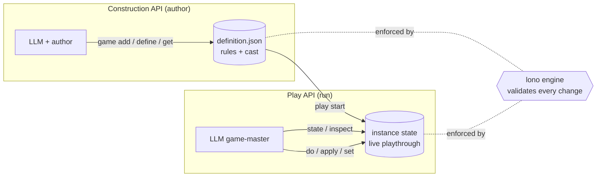
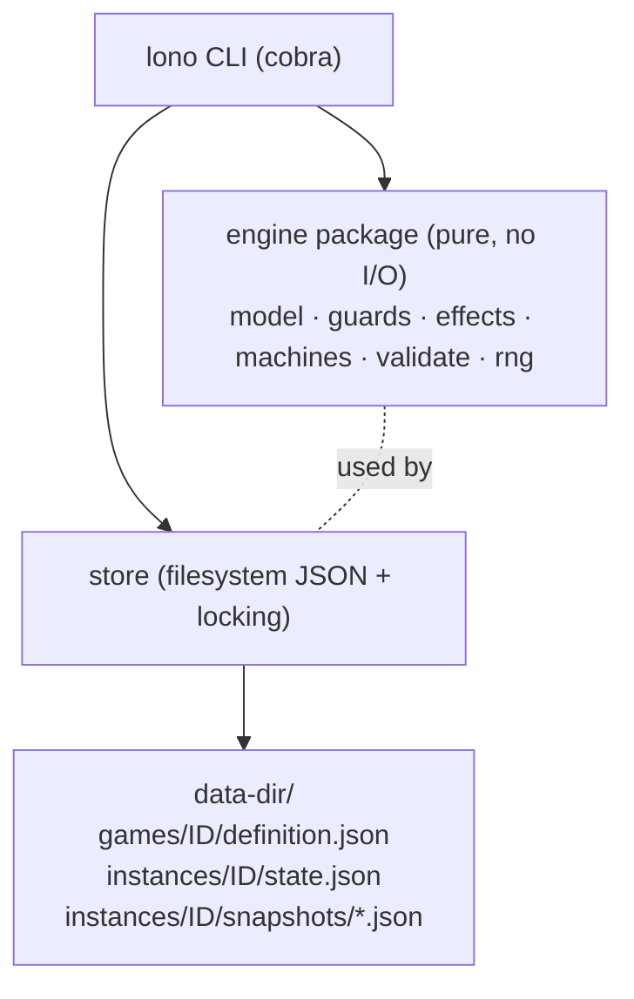
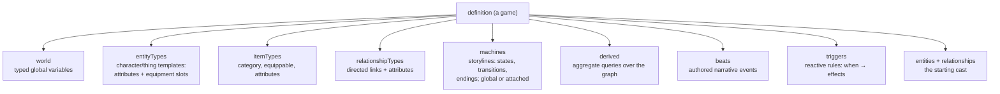
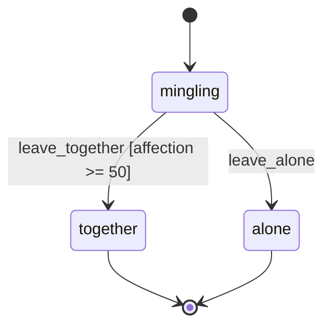
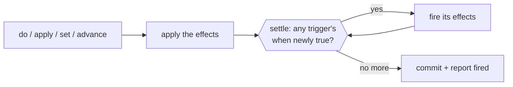
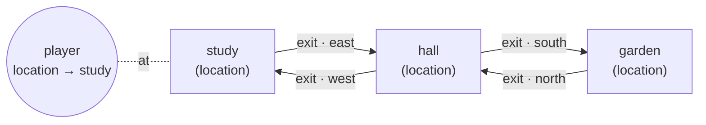
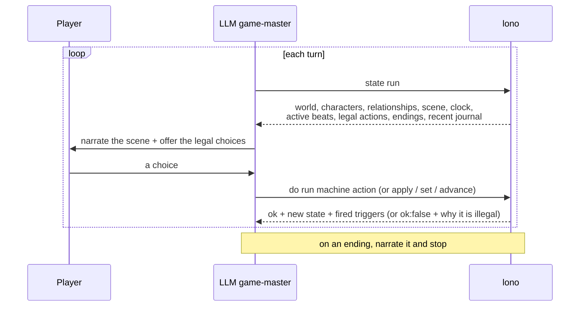

# lono

**lono** is a CLI state engine for story-driven games — interactive fiction,
RPGs, visual novels, branching narratives — built to be driven by an LLM. The model
provides the *narrative*; lono owns the *rules and the state*. Every change is
validated against the game's definition (types, bounds, references, action
guards), so the model can't drift the game into an inconsistent state.

Think of it as the **rules engine + save file** behind a text game, with a
clean, JSON-in/JSON-out command surface an LLM (or any tool-calling client) can
operate.

---

## Contents

- [Core idea](#core-idea)
- [How it works](#how-it-works)
- [Install](#install)
- [Quickstart: build and play a game](#quickstart-build-and-play-a-game)
- [Visual editor: lono studio](#visual-editor-lono-studio)
- [The two APIs: Construction vs Play](#the-two-apis-construction-vs-play)
- [The game model](#the-game-model)
- [The rule language: guards, effects, paths](#the-rule-language-guards-effects-paths)
- [Reactive systems: triggers, time & the journal](#reactive-systems-triggers-time--the-journal)
- [Worlds, maps & lore](#worlds-maps--lore)
- [Playing a game: the turn loop](#playing-a-game-the-turn-loop)
- [Command reference](#command-reference)
- [Output, data dir, and errors](#output-data-dir-and-errors)
- [Claude Code plugin](#claude-code-plugin)
- [Project layout & further reading](#project-layout--further-reading)

---

## Core idea

There are two things in lono, and keeping them straight is the whole mental model:

- A **definition** — the *rules* of a game: its world variables, the kinds of
  characters and items, relationships, the storyline state machines, narrative
  beats, endings, and the starting cast. A definition is a single JSON document
  you author and save (`<game>.lono.json`). **No game is "running" here.**
- An **instance** — a *running playthrough* seeded from a definition: the live
  world values, the concrete characters and how they feel about each other, where
  each storyline currently sits, what's been narrated, a reproducible RNG. You
  start one, read its state, and take actions.

The engine **enforces** the definition over the instance: an action only fires
if its guard holds, a value can't exceed its bounds, a relationship can't point
at a character who doesn't exist, dice are reproducible from a seed. It's also
**reactive**: rules ("triggers") fire automatically when conditions arise, an
in-game clock drives scheduled and recurring events, and a narrative journal
records what happened — so consequences, timers, and continuity live in the
engine rather than the model's memory.



---

## How it works

lono is a small, pure Go engine behind a stateless CLI. Each command reads the
relevant JSON from a data directory, performs one validated operation, writes it
back, and prints a JSON envelope. There is no daemon — the binary is the API.



The `engine` package does no I/O and is fully unit-tested; the CLI is one
frontend over it (an MCP server or function-tool adapter could be another).

---

## Install

Requires Go 1.23+.

```bash
git clone https://github.com/callsignmedia/lono
cd lono
go build -o lono ./cmd/lono      # produces ./lono (or lono.exe on Windows)
```

Or use it inside Claude Code via the bundled plugin — see
[Claude Code plugin](#claude-code-plugin) (no Go toolchain needed there).

Every example below assumes `lono` is on your PATH and uses `--data-dir ./.lono`
to keep all game data in one folder.

---

## Quickstart: build and play a game

Build a tiny gallery vignette **entirely through the Construction API**, then
play it.

```bash
D="--data-dir ./.lono"

# 1) Create the game and its rules/templates
lono $D game create gallery --name "A Night at the Gallery"
lono $D define entity-type set gallery character \
  --spec '{"attributes":{"name":{"type":"string"},"mood":{"type":"int","default":50,"min":0,"max":100}}}'
lono $D define relationship-type set gallery romance \
  --spec '{"from":"character","to":"character","directed":true,
           "attributes":{"affection":{"type":"int","default":0,"min":-100,"max":100}}}'
lono $D define item set gallery champagne --spec '{"category":"drink"}'

# 2) The storyline: a state machine with a guarded "happy" ending
lono $D define machine set gallery arc \
  --spec '{"initial":"mingling","states":["mingling","together","alone"]}'
lono $D define scene set gallery arc together \
  --spec '{"terminal":true,"ending":true,"description":"You leave the gallery together."}'
lono $D define scene set gallery arc alone \
  --spec '{"terminal":true,"ending":true,"description":"You leave alone."}'
lono $D define branch set gallery arc \
  --spec '{"id":"leave_together","from":"mingling","to":"together",
           "guard":{"target":"rel.romance.aria.player.affection","op":"gte","value":50}}'
lono $D define branch set gallery arc \
  --spec '{"id":"leave_alone","from":"mingling","to":"alone"}'

# 3) The cast (first-class characters + a starting relationship)
lono $D game add character gallery player --type character --attrs '{"name":"You"}'
lono $D game add character gallery aria   --type character --attrs '{"name":"Aria"}'
lono $D game add relationship gallery romance aria player --attrs '{"affection":10}'

# 4) A narrative beat the engine surfaces at the right moment
lono $D define event set gallery aria_smiles \
  --spec '{"text":"Aria catches your eye across the room and smiles.",
           "guard":{"target":"rel.romance.aria.player.affection","op":"gte","value":40}}'

# 5) Validate and save the portable definition
lono $D game validate gallery
lono $D game export gallery -o gallery.lono.json

# ---- play it ----
lono $D play start gallery --id run1 --seed 42 --pretty   # cast is seeded automatically
lono $D state run1                                         # scene + characters + actions + beats
lono $D apply run1 --ops '[{"op":"adjust_relationship","relType":"romance","from":"aria","to":"player","attr":"affection","by":45}]'
lono $D state run1                                         # the beat is now active; leave_together is enabled
lono $D do run1 arc leave_together                         # -> reaches the "together" ending
```

The model would narrate around each step; lono keeps the bookkeeping honest.

---

## Visual editor: lono studio

Prefer to build a game by clicking instead of hand-writing JSON? `lono edit`
starts a local web app that reads and writes the `*.lono.json` files in a
directory, organized the way a game designer thinks:

```bash
lono edit                       # serves the editor for *.lono.json in the current dir
lono edit --dir examples        # edit a specific folder
lono edit --port 4321 --no-open # choose the port; don't auto-open a browser
```

It opens `http://localhost:4321` with a single-page editor (everything is bundled
into the binary — no install, no network):

- **Sections that mirror the model** — *Game* (the pitch), *World* (variables +
  setup), *Types* (entity / item / relationship kinds), *Cast* (the entities and
  their starting relationships), *Map* (see below), *Story* (state machines, with
  endings authored as terminal states), *Beats*, *Systems* (triggers + derived
  queries), *Lore*, and a raw *JSON* tab as a universal fallback.
- **A visual map & scene editor** — the *Map* section draws your location/exit
  graph as draggable nodes with directional edges; click a place to name it, edit
  its exits (direction, locked), and place characters and objects there (it manages
  the `location` reference for you). The *Scenes* sub-tab lets you arrange "who is
  where" and bind it to a story moment — *when machine X enters state Y* — optionally
  marking a beat and writing a journal line. Each scene **compiles to a real
  trigger** (`scene_…`), so the repositioning actually happens at runtime and in the
  playtest. Map layout and scene authoring are stored under an `_editor` key the
  engine ignores.
- **Structured forms** for guards and effects — pick an op from a grouped menu and
  the right fields appear, with dropdowns populated from your own cast, item types,
  and machines.
- **Live validation** — every edit is checked by the same engine the CLI uses; the
  status pill turns red with a clickable list of problems.
- **In-editor playtest** — a side panel starts an in-memory playthrough of the
  current (even unsaved) definition: take actions (global *and* attached-machine,
  per host), advance time, and watch the journal, derived values, fired triggers,
  and endings update live.

Files are saved as pretty-printed `<id>.lono.json` you can then `game import` and
play, or commit to source control.

---

## The two APIs: Construction vs Play

They never mix. You **build** with one set of commands and **play** with another.

```mermaid
flowchart LR
    subgraph C["Construction API — edits a definition"]
      direction TB
      c1["game create / import / export"]
      c2["game add character|relationship · give"]
      c3["define var/entity-type/item/rel-type/<br/>machine/branch/scene/derived/event"]
      c4["game get / --tree  (introspect)"]
      c5["game validate"]
    end
    subgraph P["Play API — drives an instance"]
      direction TB
      p1["play start / list"]
      p2["state · actions · inspect"]
      p3["do  (guarded action)"]
      p4["apply (validated ops) · set / rm"]
      p5["snapshot create/list/restore"]
    end
    C -->|"export to file, then import"| P
```



- **Construction** mutates the *definition* only; nothing is running. Every edit
  is re-validated against the whole definition and rejected atomically if invalid.
- **Play** drives a running *instance*; it never changes the rules.

---

## The game model

A definition is a tree. Here's everything it can contain:



| Resource | What it is |
|---|---|
| **world var** | a typed global value: `int`/`float` (with min/max), `bool`, `string`, `enum`, `ref`, or `set` (a unique collection of strings/refs — party rosters, clue sets, unlocked topics) |
| **entity type** | a template (e.g. `character`) with typed attributes (including `set` collections) and equipment **slots** |
| **item type** | a thing that can be held or worn: `category`, `equippable`, static attributes |
| **relationship type** | a directed/undirected link kind between entity types, with its own attributes (e.g. `romance` carrying `affection`, `trust`) |
| **machine** | a storyline as a state machine. *Global* machines track the overall arc; **attached** machines instantiate **per couple or per character** (e.g. a romance-stage arc for each pair) and read their host via `this.*` |
| **scene / ending** | a state of a machine; mark it `terminal`+`ending` and the engine reports when it's reached |
| **branch** | a transition/action between states, gated by a **guard** and applying **effects** |
| **derived value** | a reusable aggregate over the social graph — `count`/`any`/`list`/`sum`/`min`/`max`/`argmax` — e.g. "how many characters adore the player?" or "which rooms exit from here?". `where` endpoints/values accept `{"$path":…}`, so a query can be parameterized by live state |
| **beat** | authored prose the engine surfaces as *active* when its state/guard conditions hold |
| **trigger** | a reactive rule — `{when: <guard>, effects}` (or `every: N` ticks) — the engine fires **automatically** whenever its condition arises: consequences, deadlines, upkeep, per-turn changes |
| **lore** | authored, queryable worldbuilding — `{title, text, tags, subject, when}` entries on the history of places, provenance of objects, background of people; static but revealable via the `discover` op (tracked in `discoveredLore`) |
| **cast** | the concrete starting **entities** (characters/items in the world — including `location` places linked by `exit` relationships) and their starting **relationships** |

A sample storyline machine:



---

## The rule language: guards, effects, paths

Conditions and changes are **structured JSON** (no embedded scripting), so they're
fully validatable and easy for a model to emit.

**Paths** address any value in the game:

```
world.<var>                         entity.<id>.<attr>
inventory.<id>.<item>               equipped.<id>.<slot>      worn.<id>.<slot>.<attr>
rel.<type>.<from>.<to>.<attr>       machine.<name>.state
derived.<name>                      entity.<id>.derived.<name>
itemtype.<id>.<attr>                param.<name>
this.<attr> / this.from / this.to   (inside an attached-machine transition)
clock                               cooldown.<key>            (time)
len.<path>                          roll.<store>              (set length; a stored roll)
```

**Guards** are condition trees — leaves `{target, op, value}` with
`eq ne gt gte lt lte in exists contains`, combined with `and`/`or`/`not`:

```json
{"and":[
  {"target":"entity.player.health","op":"gt","value":0},
  {"target":"rel.romance.aria.player.affection","op":"gte","value":50}
]}
```

**Effects** are an ordered op list applied atomically:

```
set · inc · dec · mul                         add_item · remove_item
create_entity · destroy_entity                equip · unequip
set_relationship · adjust_relationship · remove_relationship
set_machine_state · set_attached_state        roll (seeded dice)   mark_beat
add_to · remove_from · clear (set ops)        compute · if/then/else
schedule · cooldown (time)                    record (journal)
move (travel a ref, opt. via an exit)         discover (reveal lore)
```

The engine validates every effect (types, bounds, references) before committing,
and rolls draw from a per-instance seed so playthroughs are reproducible.

**Computed & conditional effects.** An operand can be a literal, a stored roll
(`{"$roll":"atk"}`), or another value (`{"$path":"entity.player.level"}`); the
`compute` op does arithmetic (`add|sub|mul|div|min|max|mod`); and `if`/`then`/
`else` branches an effect list on a guard. Together with a roll that's readable
as `roll.<store>`, a single action expresses a skill check:

```json
[{"op":"roll","dice":"1d20","store":"atk"},
 {"op":"if","when":{"target":"roll.atk","op":"gte","value":12},
    "then":[{"op":"compute","target":"entity.goblin.health","fn":"sub",
             "a":{"$path":"entity.goblin.health"},"b":{"$roll":"atk"}}],
    "else":[{"op":"mark_beat","beat":"you_miss"}]}]
```

So damage formulas, scaled costs, and skill checks stay in the engine — the model
doesn't do the math.

---

## Reactive systems: triggers, time & the journal

The engine doesn't just respond to commands — it reacts.

**Triggers** are rules defined on the game that fire **automatically** whenever
their condition arises. After *every* committed change (and every clock tick), the
engine "settles": it fires triggers whose `when` guard has just become true,
repeating until nothing more fires (edge-triggered, so a rule fires on the rising
edge rather than continuously; `once` fires at most once; a loop cap prevents
runaway cascades). The command's output lists which triggers `fired`.



```json
"triggers": {
  "raise_alarm": {
    "when": {"target":"world.alarm","op":"eq","value":true},
    "once": true,
    "effects": [
      {"op":"set","target":"entity.guard.hostile","value":true},
      {"op":"schedule","in":3,"do":[{"op":"set_machine_state","machine":"arc","state":"caught"}]},
      {"op":"record","text":"The alarm screams. Guards close in — you have moments."}
    ]
  }
}
```

**Time.** Each instance has an integer `clock`. `lono advance <run> [n]` ticks it;
each tick applies any **scheduled** effects now due (`{"op":"schedule","in":N,"do":[…]}`
— deadlines, delayed consequences), fires **periodic** triggers (`"every": N`),
expires cooldowns, then settles. A **cooldown** (`{"op":"cooldown","key":"confess","ticks":2}`)
gates an action's re-use: guard it with `{"target":"cooldown.confess","op":"eq","value":0}`.

**Narrative journal.** Distinct from the mechanical action history, the `record`
op (`{"op":"record","text":"Aria forgave you.","tags":["aria"]}`) appends to an
engine-owned **log** — authored by the model as it narrates, and by triggers at
consequential moments. It's surfaced in the `state` output and fully readable via
`inspect <run> log`, and it's preserved across snapshots — so a resumed session
(or one whose context was trimmed) can recall *the story so far*, not just the
current numbers.

---

## Worlds, maps & lore

A setting is built from the same primitives, no new entity kind: a **place** is a
`location` entity, a **connection** is an **`exit` relationship** between two
locations, and a mover's **position** is a `location` **ref** attribute. The map is
just a directed graph in the social graph you already have.



- **Travel** is the **`move`** effect op:
  `{"op":"move","entity":"player","to":"hall","attr":"location","via":"exit"}`.
  `attr` defaults to `location` (a `ref`); `to` must exist; optional **`via`**
  requires an `exit` from the current location to the destination, so travel
  follows real connections (errors `no exit from "study" to "garden"` otherwise).
  Pair it with `advance` for travel **time** and triggers for **arrival** events.
- **Dynamic spatial queries** are ordinary `derived` values: `where.from`/`where.to`
  and attr-predicate `value`s now accept **`{"$path":"<path>"}`** (resolved against
  live state), and a **`list`** reducer returns the array of matching ids. So
  "exits from here" and "who's here" are parameterized by the actor's *current*
  room:

  ```json
  "exits_here": {"over":"relationships",
    "where":{"type":"exit","from":{"$path":"entity.player.location"}},"reduce":"list"}
  "whos_here":  {"over":"entities",
    "where":{"attrs":[{"attr":"location","op":"eq","value":{"$path":"entity.player.location"}}]},"reduce":"list"}
  ```

  (For relationship `list`/`argmax`/`argmin`, the result is the endpoint *opposite*
  the anchored one — anchoring `from` returns the reachable `to`s.)
- **Per-instance descriptions.** Any specific room, object, or person can carry its
  own authored prose via `game add … --description "An oak-panelled study."` —
  surfaced in `state`/`inspect`, distinct from a type's generic description.
- **Lore / codex.** Authored, queryable worldbuilding — the history of places, the
  provenance of objects, the background of people — held in `Definition.Lore`
  (entries of `{title, text, tags, subject, when, intent}`). It's the *world bible*,
  distinct from beats (triggered narration) and the journal (runtime memory).
  Author it with `lono define lore set <game> <id> --spec '<LoreEntry>'`, read it
  with `lono lore list <game> [--tag t] [--subject id]` / `lono lore show <game>
  <id>`. Lore is **static but revealable**: the `discover` op
  (`{"op":"discover","lore":"<id>"}`) marks an entry known and the instance tracks
  `discoveredLore` — so the narrator can ground prose in authored history and reveal
  it as the player learns it.

---

## Playing a game: the turn loop



The contract for the driver: **read state every turn, only perform listed actions
or validated ops, never invent state.** lono is the source of truth. Each result
also reports any triggers that `fired` (automatic consequences to narrate); use
`advance` to pass in-game time, and `record` (via `apply`) to write journal
entries the next session can read back.

---

## Command reference

Run any command with `--data-dir <dir>` (or set `$LONO_HOME`); add `--pretty` to
indent JSON.

### Game lifecycle
```
lono game create <id> --name "<title>" [--force]
lono game list | show <id> | delete <id> | validate <id>
lono game export <id> -o <file>           # save the portable definition
lono game import --spec-file <file>       # load a whole definition (validated)
lono game get <id> [path] [--tree] [--depth N]   # navigate/inspect the definition
lono edit [--dir .] [--port 4321] [--no-open]    # launch the visual editor (lono studio)
```

### Construction — cast
```
lono game add character <id> <char> --type <type> [--attrs '<json>'] [--description "<prose>"]
lono game add relationship <id> <type> <from> <to> [--attrs '<json>']
lono game give <id> <char> --item <item> [--count N] [--equip <slot>]
lono game rm character <id> <char> | rm relationship <id> <type> <from> <to>
lono game list characters <id> | list relationships <id>
```

### Construction — types, world, story
```
lono define var|entity-type|item|relationship-type|derived  set|rm <id> <name> --spec '<json>'
lono define machine  set|rm <id> <name>    --spec '<json>'
lono define branch   set|rm <id> <machine> --spec '<transition json>'   # transition, upsert by id
lono define scene    set|rm <id> <machine> <state> --spec '<stateMeta json>'
lono define event    set|rm <id> <name>    --spec '<beat json>'
lono define trigger  set|rm <id> <name>    --spec '<trigger json>'      # reactive rule
lono define lore     set|rm <id> <loreId>  --spec '<lore entry json>'   # authored worldbuilding
```
(`item`=item-type, `relationship-type`=rel-type, `branch`=transition, `event`=beat — friendly aliases.)

### Play
```
lono play start <game> --id <run> [--seed N]
lono play list
lono state <run>                          # full state + actions + beats + endings + clock + journal
lono actions <run>
lono inspect <run> [path] [--tree]        # targeted read of live state (e.g. inspect <run> log, discoveredLore)
lono lore list <game> [--tag t] [--subject id] | show <game> <id>   # read the authored codex
lono advance <run> [n]                    # tick the clock: fires scheduled/periodic/reactive triggers
lono do <run> <machine> <action> [--params '<json>'] [--rel <from>,<to> | --entity <id>]
lono apply <run> --ops '<json array of effects>'   # incl. record (journal), add_to, compute, schedule …
lono set <run> <path> --value <v> | --spec '<json>' [--force]   # entity-level write (validated; --force = raw)
lono rm  <run> <path> [--force]
lono snapshot create <run> [--label "<l>"] | list <run> | show <run> <snap>
lono snapshot restore <run> <snap> [--into <new-run> | --in-place]
```

---

## Output, data dir, and errors

Every command prints one JSON envelope to stdout and exits non-zero on failure:

```json
{ "ok": true,  "command": "do", "data": { "state": {}, "actions": [] } }
{ "ok": false, "error": { "code": "ACTION_FAILED", "message": "guard not satisfied", "details": null } }
```

The data directory is resolved as `--data-dir` → `$LONO_HOME` → `./.lono`. Layout:

```
<data-dir>/
  games/<id>/definition.json
  instances/<id>/state.json
  instances/<id>/snapshots/<snap>.json
```

Common error codes: `NOT_FOUND`, `INVALID_DEFINITION` (with a `details` list),
`ACTION_FAILED`, `APPLY_FAILED`, `GUARD_FAILED`, `NO_SUCH_PATH`,
`PATH_NOT_WRITABLE`, `GAME_EXISTS`, `INSTANCE_EXISTS`, `LOCKED`, `BAD_INPUT`.
Successful results may also carry a `warnings` list (e.g. `TRIGGER_LOOP` if a
reactive cascade hit the settle cap).

---

## Claude Code plugin

lono ships as a Claude Code plugin (`plugin/`) so you can build and play games
conversationally, with the engine bundled (prebuilt binaries for macOS/Linux/
Windows — no Go needed):

```
/plugin marketplace add /path/to/lono/plugin
/plugin install lono@lono-marketplace
```

It adds two skills:

- **`creating-a-game`** — collaboratively design a game and build a validated,
  saveable definition (the Construction API).
- **`running-a-game`** — load a saved game and game-master the turn loop (the
  Play API).

See [`plugin/lono/README.md`](plugin/lono/README.md) for details.

---

## Project layout & further reading

```
cmd/lono/            CLI entrypoint
internal/engine/     pure engine: model, guards, effects, machines, derived,
                     narrative (beats/endings), equipment, navigation, validation, rng
internal/store/      filesystem persistence + per-instance locking
internal/cli/        cobra commands (the JSON-envelope frontend)
internal/editor/     the `lono edit` web app (embedded SPA + JSON API)
examples/            ready-to-run example games (see examples/README.md)
testdata/            golden example games used in the test suite
plugin/              the Claude Code plugin (skills + bundled binaries)
```

The full command/vocabulary reference (data model, ops, guards, paths) lives in
the bundled skills' `reference.md` files under
`plugin/lono/skills/*/reference.md`.
